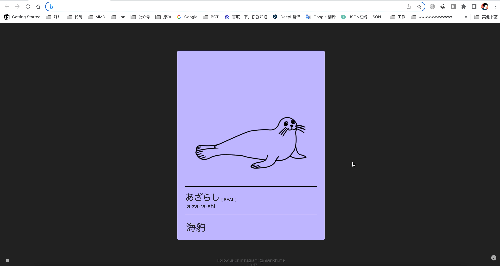
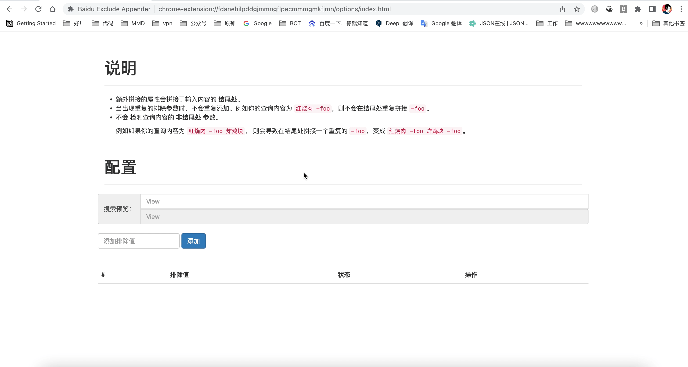

# Baidu Exclude Appender

在你进行百度搜索的时候，自动为你填充结尾处的排除参数，例如 `-csbn`。

## 使用
### 安装
#### 方式一 谷歌商店(推荐)
前往谷歌商店的 [Baidu Exclude Appender](https://chrome.google.com/webstore/detail/baidu-exclude-appender/fdanehilpddgjmmngflpecmmmgmkfjmn/related?hl=zh-CN)
安装插件到您的浏览器。

#### 方式二 releases
前往releases下载打包后的 `.crx` 文件并自行安装。

#### 方式三 使用源码
下载源码包并通过chrome开发者模式安装解压扩展包。

### 配置

### 搜索

## 协助我
欢迎通过 [pr](https://github.com/ForteScarlet/baidu-exclude-appender/pulls) 贡献您的力量，非常感谢！